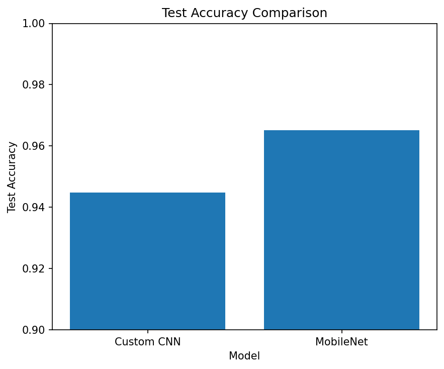
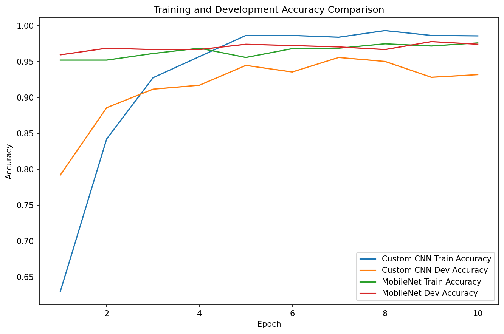
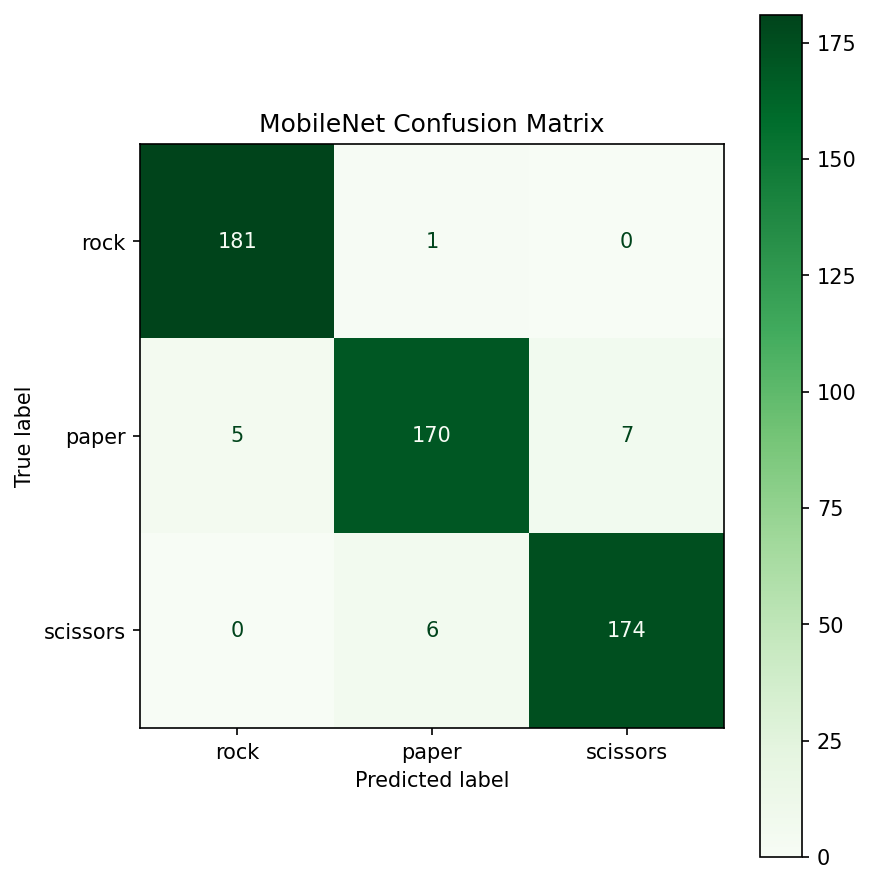

# Real-Time Rock Paper Scissors Gesture Classification

A real-time computer vision project built with PyTorch and OpenCV for rock-paper-scissors gesture classification. The project compares a custom CNN against MobileNet transfer learning and deploys the best-performing model for live webcam inference.

This project was originally developed from a university computer vision assignment and later expanded into a portfolio-focused deep learning and real-time inference project.

---

# Demo


---

# Project Overview

This project explores deep learning approaches for image-based hand gesture classification using the classic Rock-Paper-Scissors dataset.

Two approaches were implemented and compared:

- A custom Convolutional Neural Network (CNN)
- MobileNetV2 transfer learning using pretrained ImageNet weights

The final MobileNet model was then integrated with OpenCV for real-time webcam gesture recognition.

---

# Features

- Custom CNN implementation from scratch
- MobileNetV2 transfer learning
- PyTorch training pipeline
- Train/dev/test dataset splitting
- Model checkpointing
- Confusion matrix analysis
- Misclassification analysis
- Real-time webcam inference with OpenCV
- Lightweight deployment-friendly architecture

---

# Project Structure

```text
real-time-gesture-classification/
│
├── notebooks/
│   └── gesture_classification_experiments.ipynb
│
├── src/
│   └── inference/
│       └── webcam_inference.py
│
├── models/
│   └── checkpoints/
│
├── outputs/
│   ├── confusion_matrices/
│   ├── model_comparisons/
│   └── readme_assets/
│
├── data/
│
└── README.md
```

---

# Model Performance

| Model | Best Dev Accuracy | Test Accuracy | Misclassified Test Images |
|---|---:|---:|---:|
| Custom CNN | 95.58% | 94.49% | 30 |
| MobileNetV2 | 97.79% | 96.51% | 19 |

---

# Evaluation Visualizations

## Accuracy Comparison



---

## Combined Training Curves



---

## MobileNet Confusion Matrix



---

# Real-Time Webcam Inference

The best-performing MobileNet model was deployed for real-time webcam gesture classification using OpenCV.

The webcam pipeline:
1. Captures webcam frames using OpenCV
2. Applies the same preprocessing used during training
3. Runs MobileNet inference using PyTorch
4. Displays gesture predictions with confidence scores

Run the webcam inference script:

```bash
python src/inference/webcam_inference.py
```

Press `q` to quit the webcam window.

---

# Technologies Used

- Python
- PyTorch
- Torchvision
- OpenCV
- NumPy
- Pandas
- Matplotlib
- Scikit-learn

---

# Key Learning Outcomes

This project helped explore several important machine learning and computer vision concepts, including:

- Convolutional Neural Networks (CNNs)
- Transfer learning
- Image preprocessing and normalization
- Model generalization and overfitting
- Real-time inference pipelines
- Deployment challenges and domain shift
- Confusion matrix interpretation
- Error analysis and debugging

---

# Real-World Challenges

During real-time testing, webcam inference behaved differently from offline test-set evaluation due to differences in lighting, background, camera angle, motion blur, and framing.

An early deployment bug also revealed the importance of maintaining consistent class-label mappings between training and inference systems.

These observations highlighted important real-world computer vision concepts such as:
- domain shift,
- preprocessing consistency,
- deployment robustness,
- and inference pipeline reliability.

---

# Future Improvements

Potential future improvements include:

- Hand detection and cropping before classification
- MediaPipe hand landmark integration
- Additional webcam-style training data
- Stronger data augmentation
- Temporal prediction smoothing
- Streamlit or Gradio deployment
- Mobile or edge-device optimization

---

# Dataset

The project uses the Rock-Paper-Scissors image dataset originally provided as part of a university computer vision assignment.

The dataset contains labeled gesture images for:
- Rock
- Paper
- Scissors

---

# Author

Razin Rayan Rahat

Master of Information Technology (Artificial Intelligence)  
Macquarie University

GitHub: [RazinRahat](https://github.com/RazinRahat)